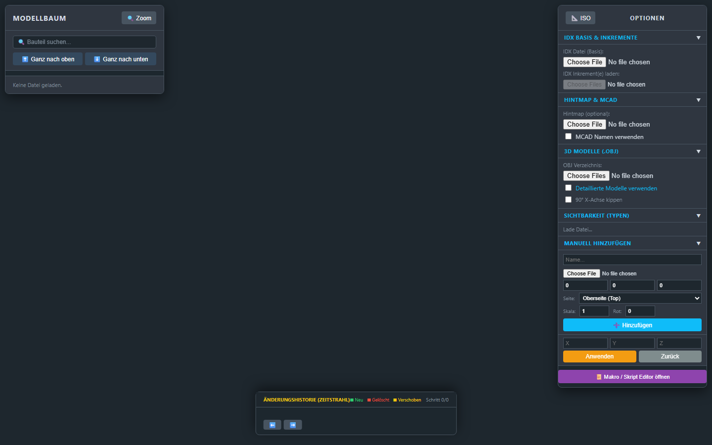
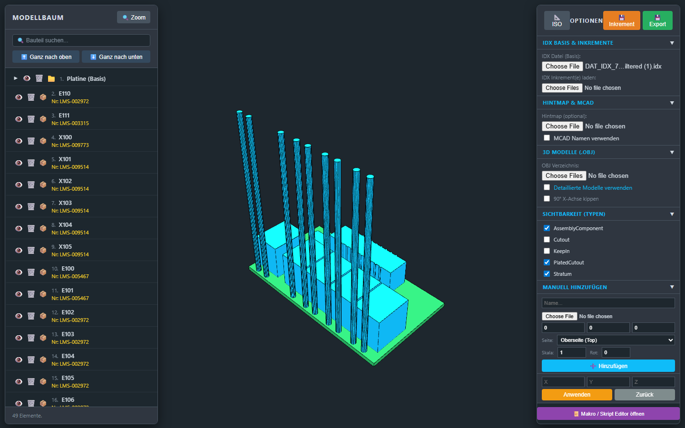
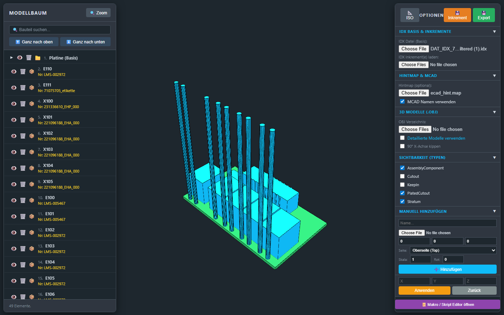
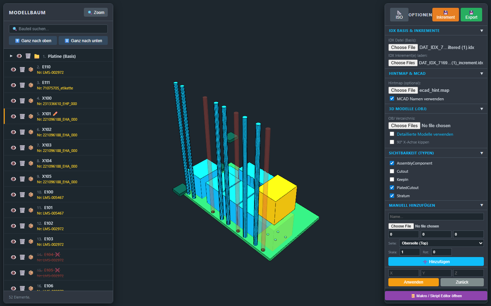
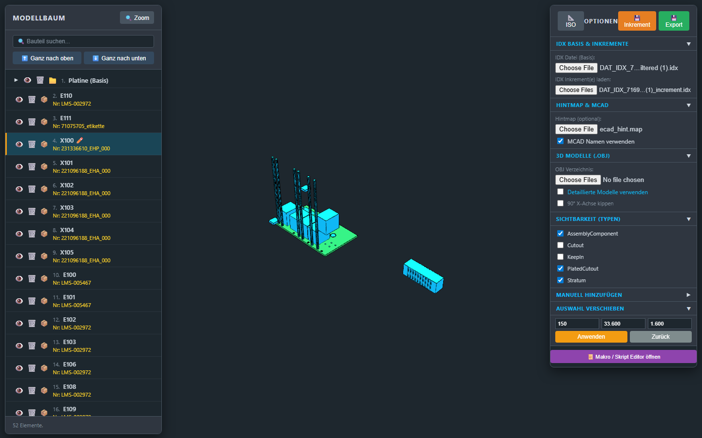
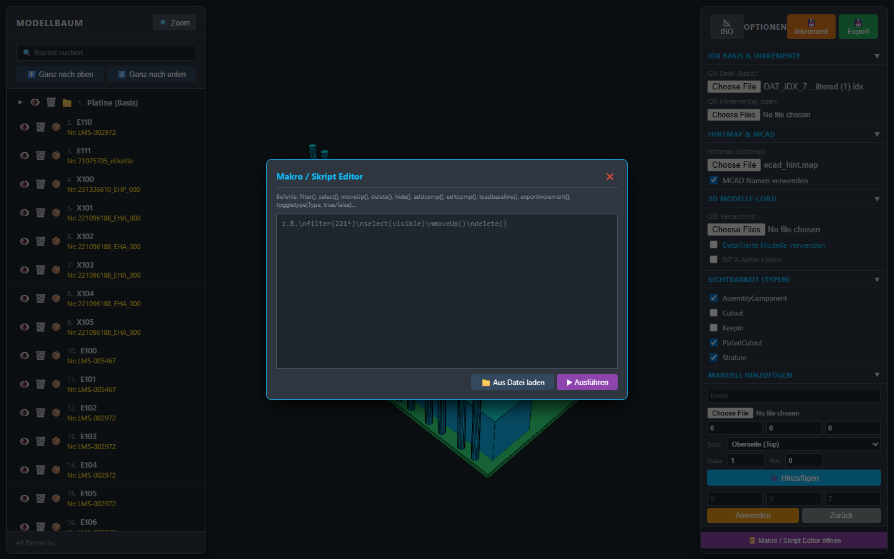

# Benutzerdokumentation: Advanced 3D IDX Viewer Pro

Diese Dokumentation führt Sie durch alle Kernfunktionen der Applikation **Advanced 3D IDX Viewer Pro**. Die Software dient der Visualisierung, dem Abgleich und der Bearbeitung von ECAD/MCAD-Daten im IDX/EDMD-Format.

---

## 1. Benutzeroberfläche und erster Start
Wenn Sie die Applikation öffnen, sehen Sie eine moderne, dunkle Benutzeroberfläche.
*   **Mitte:** Hier wird das 3D-Fenster geladen.
*   **Linkes Panel:** Beinhaltet später den Modellbaum (Ihre Bauteile) sowie die Such- und Sortierfunktionen.
*   **Rechtes Panel:** Hier befinden sich die Import-/Export-Werkzeuge, Optionen, Sichtbarkeits-Filter und manuelle Bearbeitungsmöglichkeiten.

---

## 2. Einladen der Baseline (Grundplatine)
Der erste Schritt ist das Laden der Basisplatine (`.idx` Datei).
1. Klicken Sie im rechten Panel unter **IDX Basis & Inkremente** auf **"Datei auswählen"** (unter *IDX Datei (Basis)*).
2. Wählen Sie Ihre Baseline-Datei aus (z.B. `DAT_IDX_..._filtered.idx`).
3. Das 3D-Modell wird sofort in der Mitte aufgebaut und der Modellbaum im linken Panel füllt sich mit den Bauteilen.

---

## 3. Hintmap laden und MCAD-Namen verwenden
Häufig haben ECAD-Referenzen kryptische Bezeichnungen. Mit einer **Hintmap** können Sie diese auf Ihre realen MCAD-Materialnummern mappen.
1. Klappen Sie im rechten Panel **Hintmap & MCAD** auf.
2. Laden Sie Ihre Datei (z.B. `ecad_hint.map`) über das entsprechende Feld.
3. Aktivieren Sie die Checkbox **"MCAD Namen verwenden"**. 
4. Der Modellbaum (links) aktualisiert sich sofort und zeigt nun die übersetzten MCAD-Namen an.

---

## 4. Inkremente (Änderungen) laden & der Zeitstrahl
Sie können eine oder mehrere Inkrement-Dateien laden, um chronologische Design-Änderungen nachzuvollziehen.
1. Klicken Sie unter **IDX Basis & Inkremente** auf das untere Feld für **Inkrement(e) laden**.
2. Wählen Sie die Inkrement-Dateien aus (Sie können auch mehrere gleichzeitig markieren).
3. **Der Zeitstrahl:** Unten am Bildschirmrand erscheint nun ein Zeitstrahl ("ÄNDERUNGSHISTORIE").
4. Klicken Sie auf die einzelnen "Pakete" (Bubbles), um in der Zeit vor- und zurückzuspringen. Die Box rechts unten ("Schritt X") zeigt Ihnen genau im Text an, was in diesem Inkrement verschoben, hinzugefügt oder gelöscht wurde.

---

## 5. Manuelle Änderungen ("Aktuell" Tab)
Wenn Sie im Zeitstrahl ganz rechts auf **"✏️ Aktuell"** klicken, können Sie *eigene* Änderungen am Endzustand der Platine vornehmen.

### Bauteile bearbeiten (Verschieben / Löschen)
1. **Auswählen:** Klicken Sie im Modellbaum (links) auf ein Bauteil. 
2. **Verschieben:** Sobald ein Bauteil markiert ist, klappt rechts **"Auswahl Verschieben"** auf. Ändern Sie die X/Y/Z Koordinaten und klicken Sie auf **Anwenden**. Das Bauteil bekommt im Baum ein **Stift-Symbol (✏️)**.
3. **Löschen:** Klicken Sie im linken Baum neben dem Bauteil auf das kleine Mülleimer-Symbol. Das Bauteil wird rot durchgestrichen (❌) und verschwindet aus der 3D-Ansicht.
4. **Highlighting:** Klicken Sie unten in der Liste "Aktuelle manuelle Änderungen" auf den Text einer Änderung (z.B. "X100 verschoben"). Im 3D-Fenster leuchtet **nur** dieses Bauteil auf (gelb für verschoben, rot für gelöscht, grün für neu). Ein erneuter Klick hebt die Markierung auf.

### MCAD-Änderungen ablehnen & Gegenvorschläge machen (Response)
Die Applikation unterstützt den vollständigen IDX-Response-Workflow (Accept/Reject):
1. **Änderungen sichten:** Klicken Sie unten im Zeitstrahl auf ein empfangenes Inkrement (z.B. "Schritt 1").
2. **Ablehnen:** In der Box rechts unten sehen Sie nun alle Änderungen dieses Inkrements. Klicken Sie bei einer unerwünschten Änderung direkt auf den roten Button **"Ablehnen"**.
3. **Wiederherstellung:** Das System merkt sich die Ablehnung und macht die MCAD-Änderung (z.B. eine Löschung) sofort im 3D-Fenster rückgängig.
4. **Gegenvorschlag:** Wechseln Sie unten in den Reiter **"✏️ Aktuell"**. Das wiederhergestellte Bauteil ist nun wieder da. Sie können es nun anklicken und an eine bessere Position verschieben.
5. **Response Exportieren:** Wechseln Sie zurück in das Inkrement (Schritt 1) und klicken Sie oben in der Änderungsliste auf den blauen Button **"💾 Response"**. Die Applikation erstellt nun eine normgerechte `_response.idx`-Datei, die sowohl Ihre Ablehnungen (`REJECTED`) als auch Ihre neuen Positions-Gegenvorschläge an das MCAD-System übermittelt.

### Neues Dummy-Bauteil hinzufügen
1. Klappen Sie rechts **"Manuell Hinzufügen"** auf.
2. Tragen Sie einen Namen und die X/Y/Z Koordinaten ein.
3. Laden Sie optional eine `.obj` Datei für das Aussehen hoch (ansonsten wird ein Block generiert).
4. Klicken Sie auf **"➕ Hinzufügen"**. Das Bauteil erscheint in der 3D-Welt und erhält im Baum das **Stern-Symbol (✨)**.

---

## 6. Automatisierung über Makros / Skripte
Wenn Sie häufig dieselben Routinen anwenden (z.B. bestimmte Vias löschen, Bauteile ausblenden), können Sie dies komplett automatisieren.
1. Klicken Sie unten im rechten Panel auf den violetten Button **"📜 Makro / Skript Editor öffnen"**.
2. Es öffnet sich das Makro-Fenster mittig im Bildschirm.
3. Hier können Sie Befehle direkt tippen oder ein vorgefertigtes Skript (z.B. `auto_process.txt`) über **"Aus Datei laden"** einfügen.
4. Klicken Sie auf **"▶ Ausführen"**, und das Programm wird alle Befehle blitzschnell der Reihe nach abarbeiten.

*Beispielhafte Skript-Befehle:*
*   `togglemcad(true)` - Aktiviert die MCAD Namen.
*   `filter(231)` - Sucht nach allen Bauteilen mit "231".
*   `select(filter)` - Markiert alle gefilterten Bauteile.
*   `delete()` - Löscht die markierten Bauteile.
*   `toggletype(KeepIn, false)` - Blendet alle KeepIn-Flächen aus.

---

## 7. Exportieren der Daten
Nachdem alle (manuellen oder skript-basierten) Änderungen vorgenommen wurden, müssen die Daten in Ihr System zurückgespielt werden.
Oben rechts finden Sie (sobald eine Datei geladen wurde) die Export-Buttons:
*   **💾 Inkrement:** Erstellt eine kleine, schlanke `_increment.idx` Datei, die *nur* Ihre neu getätigten Änderungen (Moves, Adds, Deletes) enthält.
*   **💾 Export:** Nimmt die Original-Baseline, pflegt alle Ihre Änderungen physisch in die Struktur ein, löscht die entsprechenden Tags heraus und exportiert eine saubere, vollständige `_filtered.idx` Baseline.

---
*Ende der Dokumentation*